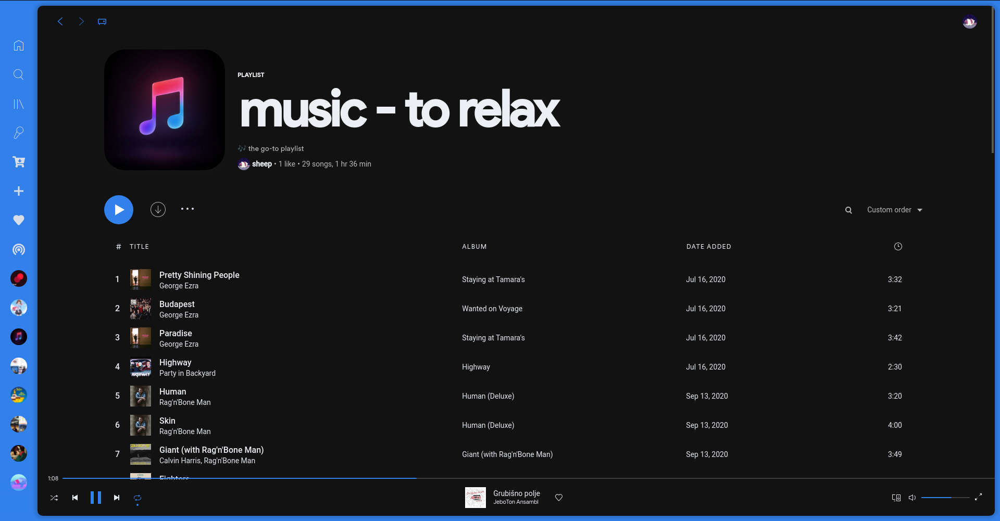

<h1 align="center">spacetify</h1>

![[Banner]](https://socialify.git.ci/lunar-theme/spacetify/image?description=1&descriptionEditable=%F0%9F%8E%B6%20Listen%20to%20music%20in%20space.%20&font=Raleway&language=1&logo=https%3A%2F%2Fexternal-content.duckduckgo.com%2Fiu%2F%3Fu%3Dhttps%253A%252F%252Fajourneyintosound.de%252Fwp-content%252Fuploads%252F2019%252F02%252Fspotify_logo.png%26f%3D1%26nofb%3D1&name=1&owner=1&theme=Dark)

## 🖼️ Preview

## ❗ Prerequisites
[Spicetify](https://github.com/khanhas/spicetify-cli) all installed and setup. If you dont know how to install it either use [Spicetify-EasyInstall](https://github.com/ohitstom/spicetify-easyinstall) or follow the install instructions on the [wiki](https://github.com/khanhas/spicetify-cli/wiki/Installation).

## 💻 Installation

Download the [Dribbblish](https://github.com/lunar-theme/spacetify/tree/main/Dribbblish) folder from the repo and paste it into your `Spicetify/Themes` folder

## 🎨 How to apply the theme

1. `spicetify config extensions dribbblish.js` Enable required extension.\
2. `spicetify config current_theme Dribbblish color_scheme Lunar` Set theme and color scheme.\
3. `spicetify config inject_css 1 replace_colors 1 overwrite_assets` Some required stuff for the theme to work.\
4. `spicetify apply` or if its the first time you are doing this `spicetify backup apply`

## 👤 Author

🐏 **sheep**

* 🌐 Website: https://sheepdev.xyz
* 📧 Email: [hi@sheepdev.xyz](mailto:me@sheepdev.xyz)
* 🐦 Twitter: [@imsheeeep](https://twitter.com/imsheeeep)
* 💻 GitHub: [@sheeepdev](https://github.com/sheeepdev)
* 💬 Discord: [sheep#2428](https://discord.com/users/429303151598895106)

## 🤝 Contributing

Contributions, issues and feature requests are welcome! Feel free to check [issues page](https://github.com/azure-moon/spacetube/issues). 

## 🌟 Show your support

Give a ⭐️ if you like this project!

## 📝 Note

This is my **personal** theme, there may be some things that you won't like. You'll need to change that by yourself.
Colors are changable by editing the variables in the file.

## 📩 License

Copyright © 2021 [sheepdev](https://sheepdev.xyz/) 
This project is licensed under the [MIT](https://github.com/lunar-theme/spacetify/blob/main/LICENSE) license.
